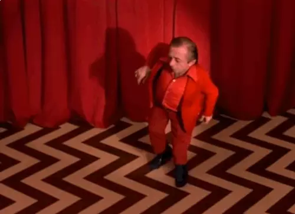

  

 

<h1 align="center">Twin Peaks Website</h1>

Website dedicated to Twin Peaks TV series.
I'm using:
<ul>
<li>React</li>
<li>styled components</li>
<li>react-spring</li>
</ul>

Page is available <a href="https://pensive-beaver-e59b1b.netlify.app/">here</a>

Page is in the development. Following issues will be carried: RWS, mute button.
